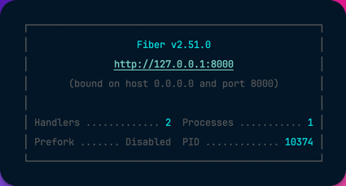
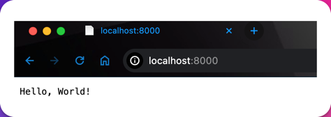

# Go Fiber Template

This is a repository to start with basic Fiber configuration and to test some trick on it

# Ep0

Create environment:

```bash
mkdir goFiberTemplate
cd goFiberTemplate
go mod init goFiberTemplate
```

To start understand better the framework we using the site documentation suggest:

```bash
go get "github.com/gofiber/fiber/v2"
mkdir cmd
touch cmd/main.go
```

And insert inside the file cmd/main.go this code:

```go
package main

import (
	"github.com/gofiber/fiber/v2"
	"log"
)

func main() {
	app := fiber.New()

	app.Get("/", func(c *fiber.Ctx) error {
		return c.SendString("Hello, World!")
	})

	log.Fatal(app.Listen(":8000"))
}
```
Now we can build our code and run it and check the result in terminal and in browser like in picture below:

```bash
go build -o server ./cmd/main.go
./server
```



and in browser:



Or clone the v0.1 of repository

```bash
git clone https://github.com/stanzinofree/goFiberTemplate.git
git fetch --all --tags
git checkout tags/0.1 -b main
cd goFiberTemplate
go mod init goFiberTemplate
go mod tidy
go build -o server ./cmd/main.go
./server
```

